## STEP 1 - INSTALLING NodeJS

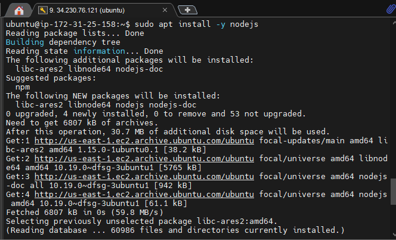
---

## STEP 2 - INSTALLING MongoDB

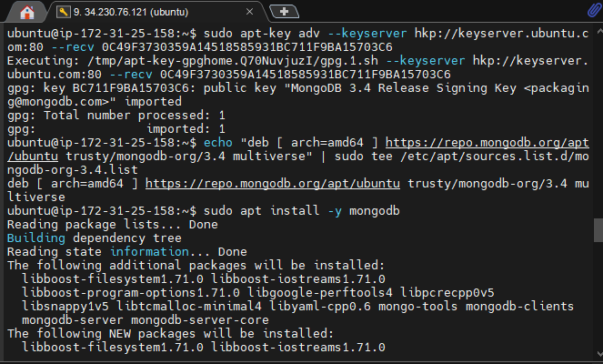
---

### MongoDB STARTED AND RUNNING

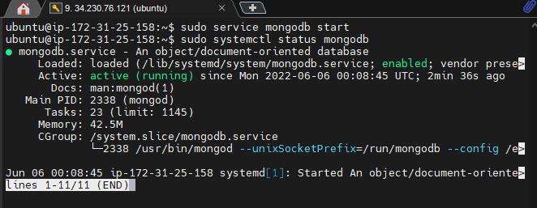
---

### Install npm (node package manager) and  body_parser

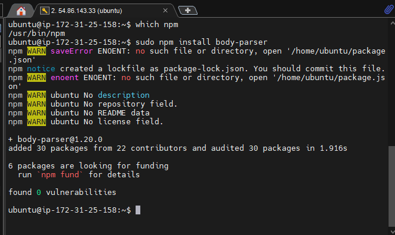
---

### npm-init

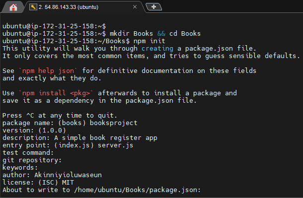
---

### npm-init created package.json file
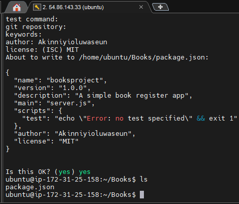
---
### server.js configured

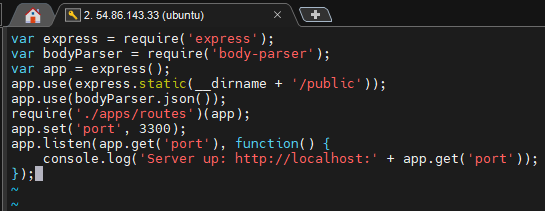
---

## STEP 3 - INSTALL EXPRESS AND SET UP ROUTES TO THE SERVER

### Routes Configured

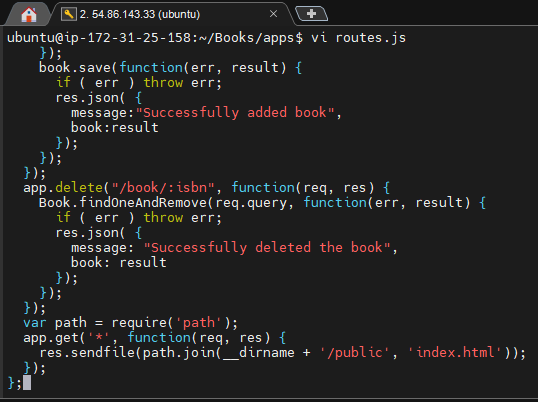
---

### Book.js Configured

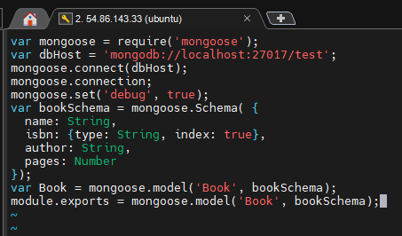
---

## STEP 4 – ACCESS THE ROUTES WITH AngularJS

### Script.js Configured

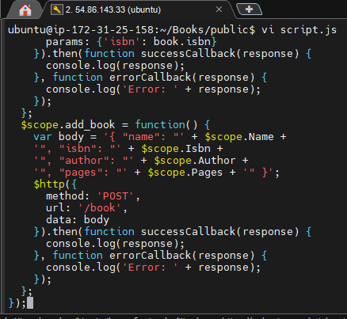
---

### Index.html Configured

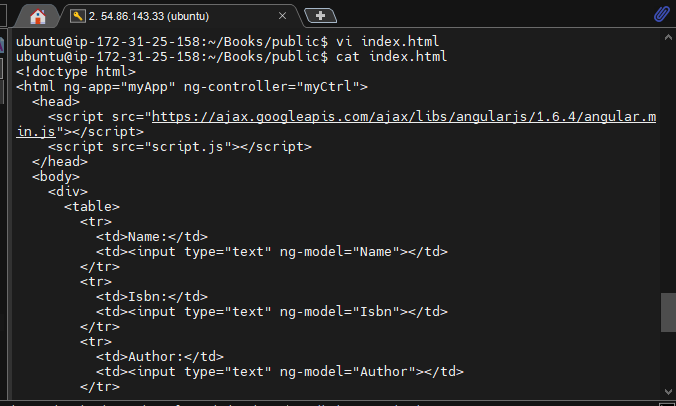
---

### Book Register Web Application Running

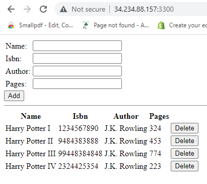
---

